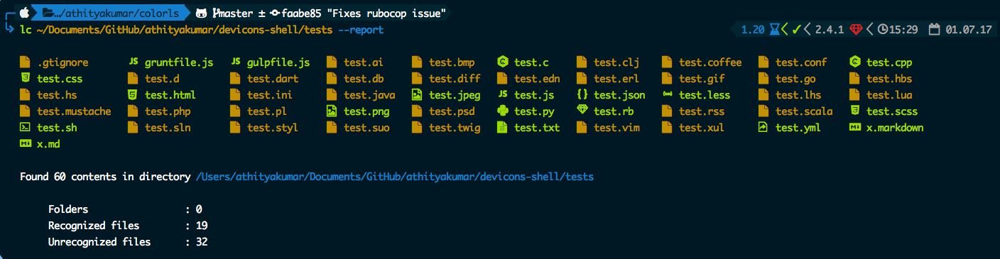

# Color LS 

[](https://travis-ci.org/athityakumar/colorls)
[](http://makeapullrequest.com)

A Ruby script that colorizes the `ls` output with color and icons. Here are the screenshots of working example on an iTerm2
terminal (Mac OS), `oh-my-zsh` with `powerlevel9k` theme and `powerline nerd-font + awesome-config` font.


# How to use

- Just `lc` : Prints all directories, files and dotfiles in current directory.

  

- With paths : `lc path(s)` prints all directories, files and dotfiles in given directory / directories.

  

- With `--report` or `-r` flag : `lc path(s) -r` : Prints all directories, files and dotfiles in directories, along with a brief report about number of files and folders shown.

  
  

# Installation steps

1. Install Ruby (prefably, version > 2.1)
2. Install the patched fonts of powerline nerd-font and/or font-awesome.
3. Clone this repository to `~/bin` (create if not exist or clone elsewhere) with
```sh
cd ~/bin && git clone https://github.com/athityakumar/colorls.git
```
4. Navigate to this cloned directory : `cd colorls`
5. Install bundler and dependencies :
  ```
  gem install bundler
  bundle install
  ``` 
6. For CLI functionality, add a function (say, `lc`) to your shell configuration file (`~/.bashrc` or `~/.zshrc`) : 
  ```sh
  lc () { ruby ~/bin/colorls/colorls.rb $1; }
  ```
7. If you like the report flag you can make it default by adding:
  ```sh
  alias lc='lc -r'
  ```
8. Change the YAML files, if required. (Say, to add / change / remove some icons)
9. Open a new terminal, and start using  `lc` :tada:

_NOTE: If you're iTerm2 on Mac, you may have to enable the nerd-font at iTerm2 > Preferences > Profiles > Text > Non-Ascii font > Knack Regular Nerd Font Complete_

# Tweaking this project



There are a couple of formats that aren't recognized yet. Custom file formats and icons can be added by changing the YAML files in this repository. Also, feel free to send a Pull Request here with the added icons. :smile:

Please feel free to contribute to this project, by 
- opening an issue for reporting any bug / suggesting any enhancement
- cleaning up the `colorls.rb` ruby script with more functionalities.
- adding support for more icons by editing the YAML files.

# LICENSE

MIT License 2017 - [Athitya Kumar](https://github.com/athityakumar/).
