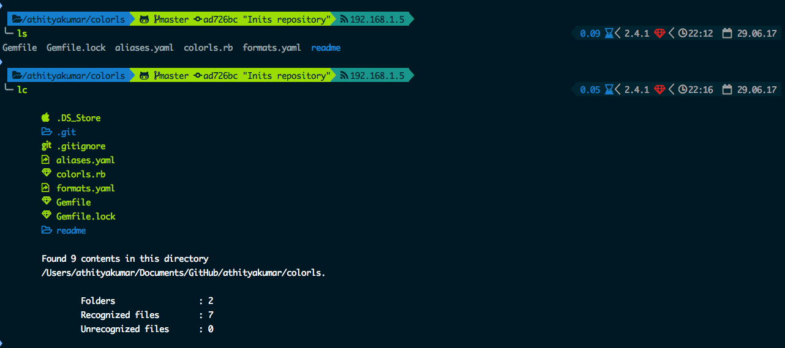

# Color LS

A Ruby script that colorizes the `ls` output with format icons. Here are the screenshots of
working example on an iTerm2 terminal (Mac OS), oh-my-zsh with powerline nerd-font.



# Making this work on your terminal

1. Install Ruby (prefably, version > 2.1)
2. Install the patched fonts of powerline nerd-font.
3. Clone this repository with `git clone https://github.com/athityakumar/colorls.git`
4. Navigate to this cloned directory : `cd colorls`
5. Install bundler and dependencies :
  ```
  gem install bundler
  bundle install
  ``` 
6. Add an cli command (say, `colorls` to your shell configuration file (`~/.bashrc` or `~/.zshrc`) : 
  ```
  function colorls()
  {
    ruby /path/to/colorls/colorls.rb $1;
  }
  ```

  _Note : I have aliased it to `lc`._

# Contributing to the repository

Please feel free to contribute to this project, by either 
- cleaning up the `colorls.rb` ruby script with more functionalities.
- adding support for more file [formats](formats.yaml) and/or [aliases](aliases.yaml).

# LICENSE

MIT License 2017 - [Athitya Kumar](https://github.com/athityakumar/).