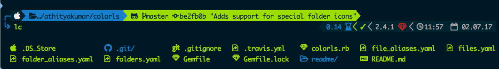
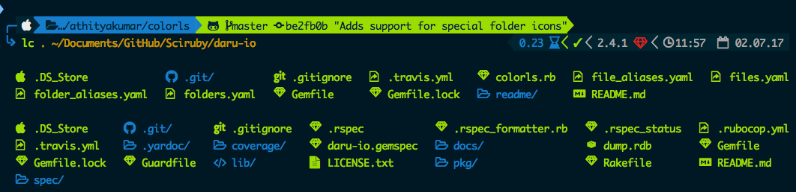
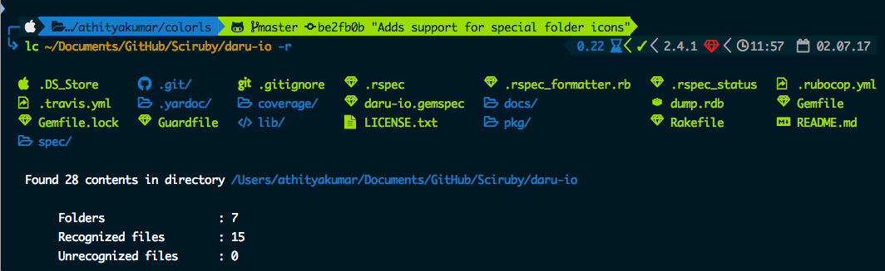
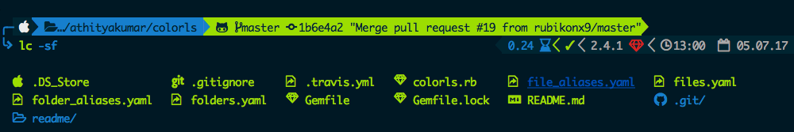
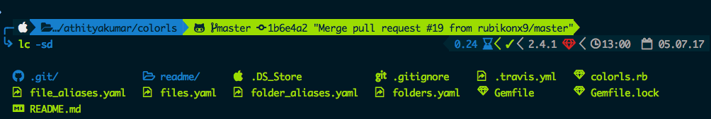
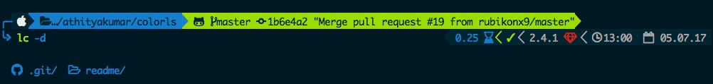
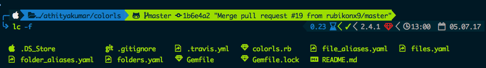
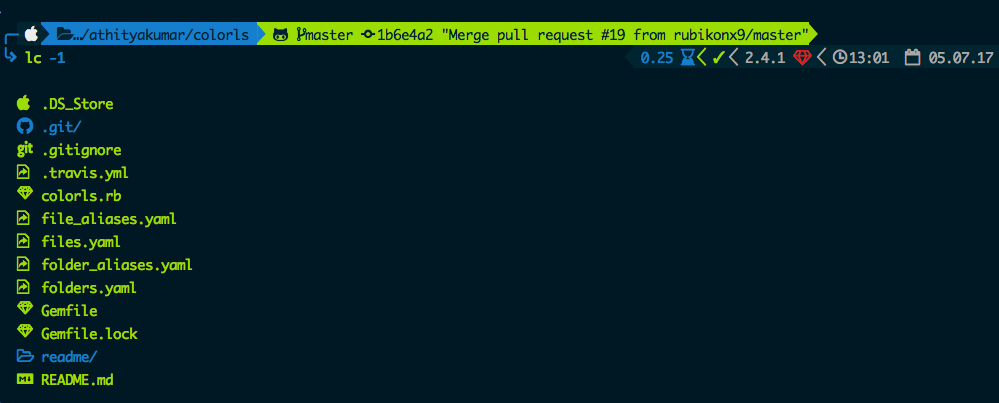

# Color LS

[](http://forthebadge.com)
[](http://forthebadge.com)

[](https://badge.fury.io/rb/colorls)
[](https://travis-ci.org/athityakumar/colorls)
[](http://makeapullrequest.com)

A Ruby script that colorizes the `ls` output with color and icons. Here are the screenshots of working example on an iTerm2 terminal (Mac OS), `oh-my-zsh` with `powerlevel9k` theme and `powerline nerd-font + awesome-config` font with the `Solarized Dark` color theme.



*If you're interested in knowing the powerlevel9k configuration to get this prompt, have a look at [this gist](https://gist.github.com/athityakumar/1bd5e9e24cd2a1891565573a893993eb).*

# Table of contents

- [Usage](#usage)
- [Installation](#installation)
- [Recommended configurations](#recommended-configurations)
- [Updating](#updating)
- [Uninstallation](#uninstallation)
- [Contributing](#contributing)
- [License](#license)

# Usage

[(Back to top)](#table-of-contents)

- With `-a` : `lc` prints all directories, files and dotfiles in current directory.

  

- With paths : `lc path(s) -a` prints all directories, files and dotfiles in given directory / directories.

  

- With `--report` or `-r` flag : `lc path(s) -r -a` : Prints all directories, files and dotfiles in directories, along with a brief report about number of files and folders shown.

  
  

- With `--sort-dirs` / `-sd` or `--sort-files` / `-sf` : Entries are sorted directories-first or files-first, and then alphabetically (case-insensitively) before being printed.

  
  

- With `--dirs` / `-d` or `--files` / `-f` : Entries are filtered so that only directories or files are shown.

  
  

- With `-1` : Entries are printed in a column (one per line), just like `ls -1` does.

  

- Additional flags: `--almost_all` or `-A`, `--long` or `-l`, `--tree` or `-t`

# Installation

[(Back to top)](#table-of-contents)

1. Install Ruby (preferably, version > 2.1)
2. Install the patched fonts of powerline nerd-font and/or font-awesome. Have a look at the [Nerd Font README](https://github.com/ryanoasis/nerd-fonts/blob/master/readme.md) for more installation instructions.

    *Note for `iTerm2` users - Please enable the Nerd Font at iTerm2 > Preferences > Profiles > Text > Non-ASCII font > Knack Regular Nerd Font Complete.*

3. Install the [colorls](https://rubygems.org/gems/colorls/) ruby gem with `gem install colorls`

    *Note for `rbenv` users - In case of load error when using `lc`, please try the below patch.*

    ```sh
    rbenv rehash
    rehash
    ```

4. Start using `colorls` :tada:

5. Have a look at [Recommended configurations](#recommended-configurations).

# Recommended configurations

[(Back to top)](#table-of-contents)

1. To add some short command (say, `lc`) with some flag options (say, `-r`)b y default, add this to your shell configuration file (`~/.bashrc`, `~/.zshrc` or `~/.fishrc`) :
    ```sh
    alias lc='colorls -r'
    ```
2. For changing the icon(s) to other unicode icons of choice (select icons from [here](https://nerdfonts.com/)), change the YAML files in a text editor of your choice (say, `subl`)

    ```sh
    subl $(gem which colorls)/../yaml/
    ```

# Updating

[(Back to top)](#table-of-contents)

Want to update to the latest version of `colorls`?

```sh
gem update colorls
```

# Uninstallation

[(Back to top)](#table-of-contents)

Want to uninstall and revert back to the old style? No issues (sob). Please feel free to open an issue regarding how we can enhance `colorls`.

```sh
gem uninstall colorls
```

# Contributing

[(Back to top)](#table-of-contents)

Your contributions are always welcome! Please have a look at the [contribution guidelines](CONTRIBUTING.md) first. :tada:

# License

[(Back to top)](#table-of-contents)


The MIT License (MIT) 2017 - [Athitya Kumar](https://github.com/athityakumar/). Please have a look at the [LICENSE.md](LICENSE.md) for more details.
